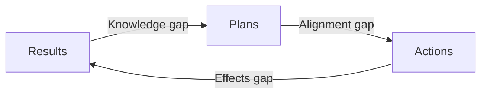

# Thursday, Keynote #2

## Factors

> What on Earth is going on?

## Predictions

### Quality is going to become even more important. 

But we're probably going to screw it up *big time*
	- We're going to have to work hard for good quality

We know we can expect better (the rating scores) but we got used to crappy things. We stopped fighting.

> The things that you do quickly are the things that are gonna stay the longest

Intellectual gaps
We know things work, but not how or why (~ AI).

### Teams will have more to do

New quality attributes:
- Mental health will drive the quality
- Sustainability (environmental, social, economical)
- Ethics ("should we be doing this?")
- Minimalism: the art of **not** doing things. "Do we really need this?", "Can we make it smaller and easier?" Be wary of decomplexification vs oversimplification

**Even more roles and responsibilities**

If we externalize expertise, we increase the feedback loop

### The [[shaping testing|shape]] of teams will have to change
- We'll still need specialists. Nobody can have all the deep knowledge that we need ([[UX]], security, etc.)
- We need new ways of collaborating
	- Teams doing day to day activities and being coached/helped by experts

### Testers, and all roles, are going to have to comb [[shaping testing|shape]]

T-Shape -> PI shape (two or more specializations) -> Comb

![[drawings/comb-shaping.png]]

Be like a cameleon, change colors based on context

### Exploratory testing will be **crucial** 
But not enough on its own.

### We need to understand friction

> It is goddamn hard to work with other people.

Invidividuals with a collective goals -> [[Friction]]
Friction is incraesed when there are more decision makers involved, and in changing environments

There is no way to get rid of friction.

### Conflict training

People working together **are** going to clash heads. 

#### Resolving conflicts
- Cannot fix other people's conflict
- Learn to
	- Separate observation from interpretation
	- Accept others' feelings
	- Move forward to attack the problem, not each other
- BUT it is easier said than done

## What does it all mean?
- More quality on less budget
- More people on smaller teams
- Better value in less time
- Decomplexification without oversimplification
- ....

### Let's not panic

**Individually**
- Practice our communication
- Practice observational skills
- Get conflict training
- Keep learning and comb shaping (be curious, asking questions, etc.)
- Cultivate a growth mindset
- Be more of a cameleon than a chimera 🦎

**Within the team**
- Share knowledge and tasks. We don't know silos or bottlenecks
- Understand friction
- Talk about risk and how to mitigate it
- Focus on value and minimal, sustainable solutions
- Be willing to experiment in how to work together. Be creative about it.

## Living in uncertainty will become more usual

> *"Just because things stayed the same for a long time didn't mean you had them in your control"* - Her coach

> *"If you're invested in security and certainty, you are on the wrong planet"*
