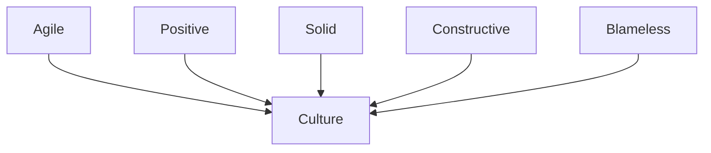

> *"Our greatest glory is not in never falling, but in rising every time we fall" - Confucius*

How we react when mistakes happen, what we learn from them

## Summary

- Meaning of agile error culture
- Shaping conditions on the way there
- How to learn from things that go wrong

## Making mistakes

Admitting a mistake is the first step to learning from it

> *"Success consists of going from one failure to failure without loss of enthusiasm" - Winston Churchill*

A person who never made a mistake has never tried anything new.

## Why Phoenix?

In Greek mythology and many other cultures, the phoenix is known for rising from the ashes.
-> Ability to keep on going, to overcome difficulties even after complete failure

What would be the best way to handle mistakes?

## Agile Error Culture

### Successful mistakes

Can mistakes result in something good?

Trial and error has often been the driving factor of innovation and many of humanity's greatest inventions and progress.

### Advantages

By increasing
- Learning speed
- Creative thinking
- Innovative process
- Employee engagement
- Talent retention
- Benefit from the experience of other colleages

We decrease
- **Cost**

### Conditions and steps

- ***Transparency***
- Respect
- Courage
- Openness

But also

- Management examples
	- Even managing directos make mistakes
	- They should share their mistakes and employees will follow their examples
- Growth mindset (~ agile) vs fixed mindset (evidence for incompetence, avoiding challenges)
	- Mistakes with a growth mindset are an opportunity to learn
	- Seeking challenges
- Focus on the system instead of the person
	- Open discussion about the mistakes without blaming
	- Focus on the circumstances that lead to the mistakes happening
	- Don't focus on personal characteristics. People are probably trying to do their best. There are reasons for mistakes (deadlines, etc.)
- Positive feedback
	- Negative feedback is better than no feedback
	- Proactively ask for feedback
	- Positive feedback is better than negative feedback
	- No feedback means missing a chance to learn
	- Important to bring the feedback about a failure framed in a positive way (for a better impact)

Example of framed feedback
- Negative : "you are missing deadlines and it is impacting the rest of the team and the project"
- Positive : "I've noticed you are finding time-management a challenge. Is there anything I can do to help with that?"

## Error learning steps

**3A+ model**

1. Admit: accept that something went wrong
2. Analyze: 
	- How and why did the error happen (focusing on the system, circumstances). 
	- Which conditions lead to this error happening?
3. Assure
	-  Learn from the mistake
	- Prevent them from happening again
	
**+ Share them so other people can avoid them**

## Types of mistakes

- **Error of omission**: Not doing something that should have been done
- **Error of commission**: Doing something that should not have been donne or doing it the wrong way

*How can we know what should or should not be done?*
-> Laws, external requirements, stakeholders requirements, new insights, experiments, company standards, etc.

#### Examples

- Error of omission: no preprod environment configured properly to test some integration with a legacy system, so the check was forgotten
	- Learned that when doing tests on environments used by other people, be mindful of whether the data might be used by the other people
- Error of commission: deleting important data, too much, too soon
	- Ask the team/yourself : are we sure we need to delete it now? Won't it impact other teams? Won't we need it in the future

## Error retrospective

**Good**
- Useful as addition to other retro forms
- More focus on errors and learning how to prevent them from happening again
- Error categories are helpful: categorizing an error is already a first insight into it
- Deeper conversation and insights
- More focus on the **why**

**Bad**
- No direct attention to what went well
- Not celebrating successes

## Tester's lifecycle mistakes and learnings

Data cycle: CRUD

We can use software lifecycles to categorize the errors in one of the phases.

**Test approach lifecycle**
- Set up new test approach
- Work based on test approach
- Adjust test approach
- Finish / Hand over

**Mistakes that can happen in the test approach lifecycle**
- Not listening to the stakeholders enough
- Trying to make the approach "really work" instead of focusing on what wasn't working and why

-> Classify the errors -> How do I want to do it next time?

## Questions

- Can some errors be a negative thing?
	- If we make the same mistake again and again, then you haven't learned from it and it is not really positive
- How to keep up with the agile error culture when there are pressing deadlines
	- If the company is really in the mindset of the culture, the managers should protect the employees from working too hard with deadlines
	- As an employee, if you notice deadlines are hard, you should talk to the managers
- How to prevent error retrospectives from becoming a blaming game?
	- Not writing mistakes made by someone else but our own mistakes (-> admitting)
	- If blaming takes place, it would be the role of the Scrum master of whoever drives the meeting to mitigate it
- How to draw a line between a mistake and a waste (~ lean)
	- Lean and Agile can co-exist this way because by learning from a mistake and preventing it from happening again, you eliminate that "waste" in the future
- How to handle it within a team?
	- Someone in charge should give examples
	- Positive feedbacks
- Handle new hires to adapt to the error culture?
	- Evaluate the agile mindset: eager to learn, grow, open person (willing to have open discussion about mistakes without putting the blame)

