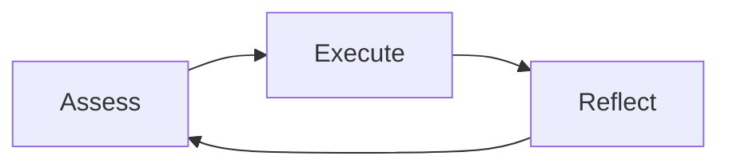
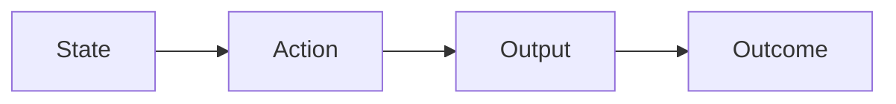

## Analogy with games

Big tasks to do in testing -- Main quests

- New Dev. Workflow
- Automated test coverage
- Beta Test process
- Testing an entirely new feature

Smaller tasks -- Side quests

- Small workflow adjustment
- Test coverage notes
- Team testing dojo
- Regression testing

## Assessment
> What is the current state? 

--> Explore/Discover the environment that we have

- Urgent deadlines
- Learning opportunities
- Tools upgrades
- Tackling unknowns
- Team well-being
- Improving on weaknesses
- Personal fulfillments

The situation is a series of tasks in those categories

## Execution

> Which action should we take?

Explore the possibilities
- Sanity test improvement
	- Low effort
	- One time action
	- Automation
	- Short-term gain
- New release E2E test
	- Mid effort
	- One time action
	- Automation
	- Mid-term gain
- Modify release process
	- High effort
	- Routine
	- Dev process
	- Long-term gain

By adding characteristics, information to the tasks, we can more easily choose which ones fit.

## Validate the choice

## Reflection

> How did we do?

Some checks:
- Are we happy with the outcome, does it match our goals?
	- Maybe it can be applied elsewhere
	- Can it be built upon for other things
	- Can we optimize it
	- Let's keep doing it, monitoring it
- Goal missed?
	- Why?
	- Repeat the attempt with a different approach, a fix
	- Try a different tactic

## Continuous analysis
- Measure outcomes
- Document the learnings (sometimes, something that makes sense in our head doesn't when it's put on paper)
- Share and discuss
- Revisit results : after a while we'll approach them with a new mindset, we've learned new things in the meantime, etc.
- Practice this daily

## Evaluation of learnings

- Which actions should we take to achieve X ?
- Which actions should we avoid in the future?
- How do we ensure that our evaluation(s) of the outcome(s) is (are) correct?
- Can we take more actions in this area?
- Should we take those actions, even if we can?

## Summary

- Try to maintain a sense of tasks in the environment
- Prioritize the tasks based on the potential outcome
- Evaluate task results to draw insightful learnings